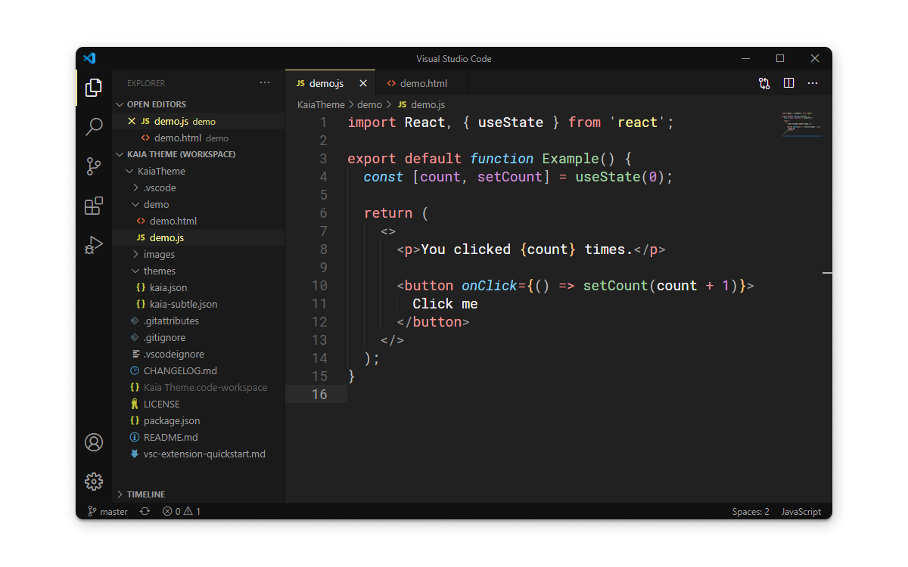
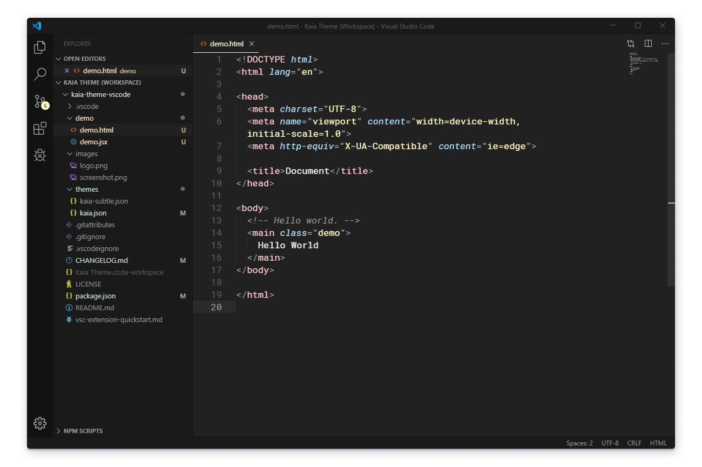

# Kaia for Visual Studio Code

A Monokai-inspired theme for Visual Studio Code with a focus on accessible contrast ratios.

**Kaia**

**Kaia Subtle**

## Installation
1.  In Visual Studio Code, search for `Kaia` in the extensions side bar and install it.
1.  Click **Reload** to reload Visual Studio Code to make the extension available.
1.  From the gear menu or the Show All Commands (CTRL + SHIFT + P) menu select: Color Theme > **Kaia**.